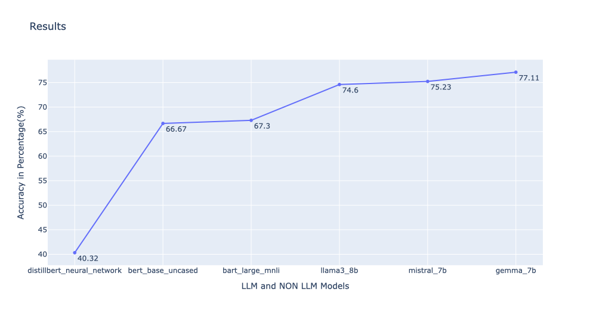

# Fine-Tuning Language Models and Non-LLM Models

This repository contains the code and results for fine-tuning various language models (LLMs) and non-large-language models. The models included in this study are:

- [distillbert_neural_network](https://github.com/SahilCarterr/FinetuningLLM/blob/42828fe5c0497de38e192678f91897ac3f85e4cf/distill_bert_nueral_network.ipynb)
- [bert_base_uncased](https://github.com/SahilCarterr/FinetuningLLM/blob/889038653a0933922aaf5aec052c8683d450199e/Bert_base_uncased_Finetuned.ipynb)
- [bart_large_mnli](https://github.com/SahilCarterr/FinetuningLLM/blob/889038653a0933922aaf5aec052c8683d450199e/bart_large_mnli_Finetuned.ipynb)
- [llama3_8b](https://github.com/SahilCarterr/FinetuningLLM/blob/889038653a0933922aaf5aec052c8683d450199e/Llama3_8b_finetuned.ipynb)
- [mistral_7b](https://github.com/SahilCarterr/FinetuningLLM/blob/889038653a0933922aaf5aec052c8683d450199e/mistral_7b_v3_finetuned.ipynb)
- [gemma_7b](https://github.com/SahilCarterr/FinetuningLLM/blob/889038653a0933922aaf5aec052c8683d450199e/gemma_7B_finetuned.ipynb)

## Overview

The goal of this project is to compare the performance of different fine-tuned models on a specific task. The accuracies achieved by these models are as follows:

| Model                   | Accuracy (%) |
|-------------------------|--------------|
|distillbert_neural_network | 40.32        |
| bert_base_uncased       | 66.67        |
| bart_large_mnli         | 67.30        |
| llama3_8b               | 74.60        |
| mistral_7b              | 75.23        |
| gemma_7b                | 77.11        |

## Results

## Dataset Preprocessed
* Dropped `sq`,`sub_topic`, `sub_sub_topic` columns
* Removed all links and emojies
* Replaced Numbers with words
* Droped nan values
* Removed empty rows
